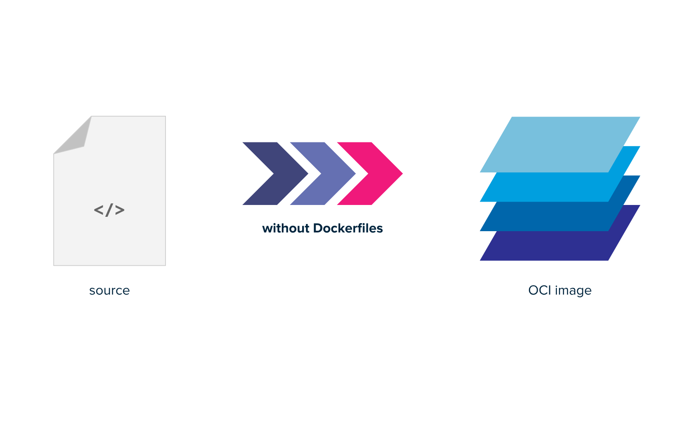
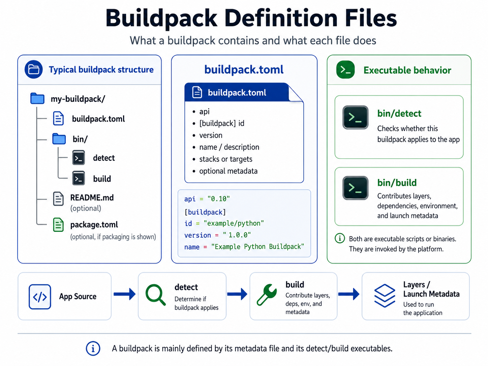
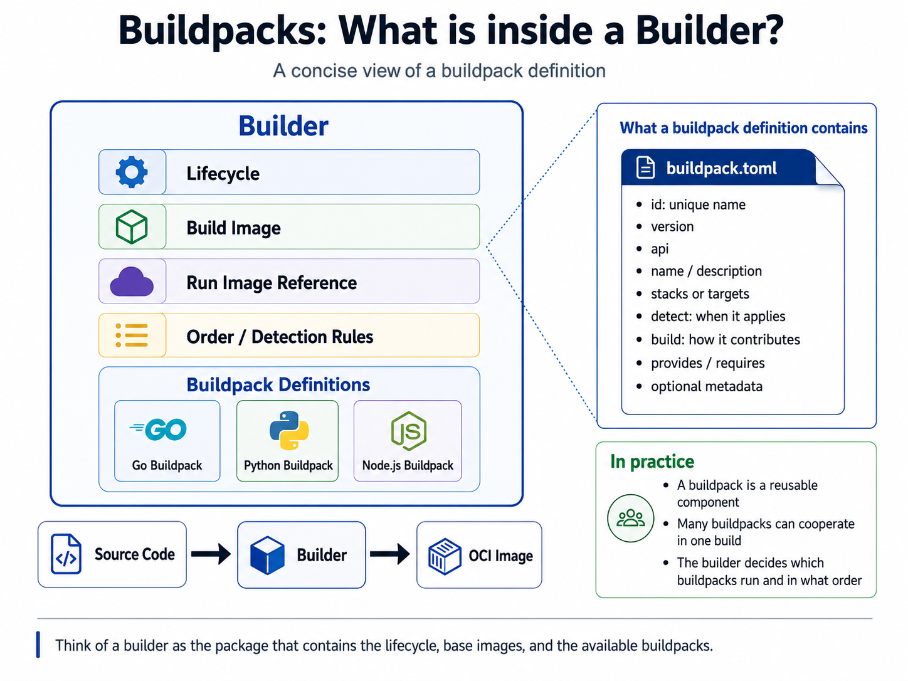
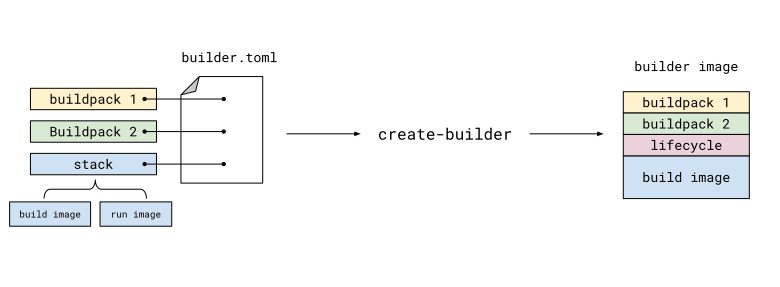

## Introduction

### What is Buildpacks?

[`Buildpacks`](https://buildpacks.io) or
[`Cloud Native Buildpacks`](https://buildpacks.io) is a tool that solves the
painpoints that some may face when working with containerized workloads on
the question of how to build them in a similar fashion all across the board.
Buildpacks automate the process of building a container by using pre-defined
and centrally managed building processes to build containers rather than relying
on each developer or service team to manage their own Dockerfiles.



If you have Buildpacks in your toolbox the build process of your applications
will look like this

```sh
pack build --tag my-favorite-app --builder gcr.io/buildpacks/python
```

### What are Containers?

Containers are a technology which revolutionized the process of building and
deploying applications. It allowed and encouraged the entire Software
Engineering industry to be more agile and confident in shipping software.
`Containers` do that by creating a build artifact which can be deployed and
with the help of container runtime get executed on the run environment without
needing anything else. You can read about what comprises in a container image
[here](https://specs.opencontainers.org/image-spec/).

### How containers are built

The way of building containers generally involves doing the following steps

1. Building an application in your favorite language with your preferred tools.
    For e.g. `Nodejs`

2. Writing a [`dockerfile`](https://docs.docker.com/reference/dockerfile/) or
    [`containerfile`](https://man.archlinux.org/man/Containerfile.5.en) which
    specify how your application is built, packed and delivered as a image that
    can be ran by the Container Runtime.

    Writing a good Dockerfile means that engineers need to know how docker
    works as well as know the Dockerfile reference schema present
    [here](https://docs.docker.com/reference/dockerfile/)

    A sample Dockerfile looks like this

    ```Dockerfile
    # Use an official base image
    FROM node:20-alpine

    # Set the working directory inside the container
    WORKDIR /app

    # Copy dependency files first (for better layer caching)
    COPY package*.json ./

    # Install dependencies
    RUN npm install

    # Copy the rest of the application code
    COPY . .

    # Expose the port the app runs on
    EXPOSE 3000

    # Define the command to run the app
    CMD ["node", "server.js"]
    ```

3. Building the container using a tool like `docker`, `podman` or `buildah`,
    which would take the contents of Dockerfile, execute them one by one and
    create a deployment artifact i.e. a `Container` image at the end of it

Lets see how Buildpacks can help us solve this

### Hands on time

1. Lets start the playground
2. Examine the folders that are present in them, you should see an example
   directory with several subdirectories in them each containing a
   web-application defined in a different programming language.
3. Try to build the `python-hello` application.

   ```sh
   pack build python-app --path examples/python-hello --builder paketobuildpacks/builder-jammy-base
   ```

   Lets try to run and test it

   ```sh
   docker run -p 8080:8080 python-app
   ```

4. Try to build the `golang-hello` application.

   ```sh
   pack build golang-app --path examples/golang-hello --builder paketobuildpacks/builder-jammy-base
   ```

   Lets try to run and test it

   ```sh
   docker run -p 8080:8080 golang-app
   ```

5. Try to build the `nodejs-hello` application.

   ```sh
   pack build nodejs-app --path examples/nodejs-hello --builder paketobuildpacks/builder-jammy-base
   ```

   Lets try to run and test it

   ```sh
   docker run -p 8080:8080 nodejs-app
   ```

That's it. With buildpacks, building a software into a containerized deployment
require no involvement from the dev team, they can just build their software
the way they want and using pack cli's build command, it can get built in the
way platforms teams want.


## How does buildpacks work?

While we described buildpacks as a whole previously, it was a broad definition
and now we should dig a bit deep down to understand how the creation of this
build artifact happens and what different moving parts are involved in this
process.

### Buildpack



A Buildpack is a software, that transforms application source code into runnable
artifacts by analysing code, detecting different files and determining the best
way to build it. it is usually written as scripts that dictate what happens
during a build lifecyle and decide how the container image should be build. The
scripts come together to create a build lifecycle which includes steps like

1. analyse
2. detect
3. restore
4. build
5. export

But inorder to define a buildpack, you do not need to define all of the phases
yourself, simplest buildpacks can be built with just the use of `build` and
`detect` phases defined. We are gonna build a buildpack below. 😉

### Builders



A Builder is an OCI image *(i.e. not always a container)*, that runs the lifecycle stages
of the buildpacks that are registered with it. It uses its own filesystem along
with the build context i.e. **your application code** to complete a build
process. Builder OCI Image consists of

1. Build Image
2. Lifecycle binary
3. Buildpack definitions

Pack CLI using these definitions along with Lifecycle binary and the build-time
image to contruct layers for the run-time image which are then added on top of a
run-time base image. We already discussed a little about how lifecycle works and
we will see it in more details when we create our own buildpack definition.



## Setting up Buildpacks ourselves

We learnt how the pack cli can be used to create docker containers then we
learnt what different concepts make buildpacks able to do what it does, now its
time to build our own builder and a buildpack and then test a build with it.

### Writing a custom buildpack

A buildpack is a set of lifecycle scripts that when executed, if they get
completed produce a build artifact that can be turned into a docker container.
We in the previous step used [Paketo](https://paketo.io/) buildpacks that were
included in the paketo builder that we used when we ran the command

```sh
pack build python-app --path examples/python-hello \
    --builder paketobuildpacks/builder-jammy-base
```

We used the same builder to build application for all the languages, what it
means is that the builder that we referenced consisted of multiple buildpack
definitions within and when we ran the commands they all ran and the ones which
passed the initial `detect` phase, were used to complete the rest of the build
process.

That was an example of a well build and managed builder that an entire community
relies upon. What we are going to build will only be for building a golang
web-service, it is a great starter and will help you understand the basics so
that you can go on and build complex ones if you chose to do so.

Lets begin with the process, we can use Pack CLI to completely build a builder
as well as new buildpacks and we would not require any other tooling apart from
that.

---

1. **Creating a sample buildpack using Pack CLI**

  ```sh
  pack buildpack new registry.iximiuz.com/examples/buildpacks/golang-buildpack \
    --api 0.10 \
    --path golang-buildpack \
    --version 0.0.1 \
    --targets "linux/amd64"
  ```

2. **Examine the generated directory**

  There exists a directory called `bin/` and a single file called
  `buildpack.toml`. Buildpack.toml defines necessary metadata about the
  currently defined buildpack and the `bin/` directory defines `detect` and
  `build` scripts, which are nothing but empty scripts that just end with a
  `0` signal. That is, they always succeed without producing anything.


  ::tabbed
  ---
  tabs:
    - name: tab1
      title: buildpack.toml
    - name: tab2
      title: bin/build
    - name: tab3
      title: bin/detect
  group: buildpack-files
  ---
  #tab1
  ```toml
  api = "0.10"
  WithWindowsBuild = false
  WithLinuxBuild = false

  [buildpack]
    id = "registry.iximiuz.com/examples/buildpacks/golang-buildpack"
    version = "0.0.1"

  [[targets]]
    os = "linux"
    arch = "amd64"
  ```
  #tab2
  ```bash
  #!/usr/bin/env bash

  exit 0
  ```

  #tab3
  ```bash
  #!/usr/bin/env bash

  set -euo pipefail

  layers_dir="$1"
  env_dir="$2/env"
  plan_path="$3"

  exit 0
  ```
  ::

3. **Constructing the detect script**

  Detect script which is present in `bin/detect` is something which detects
  presence of certain files in the build context, to try to figure out whether
  it makes sense to run the rest of buildpack or not. For example in this
  buildpack since we are building it for golang, we can check whether `go.mod`
  file is present in the build context or not, if it is present we exit with
  `0` that means success and if it is not present we exit with `1`.

  ```bash
  #!/usr/bin/env bash
  set -euo pipefail

  DEFAULT_GO_VERSION="1.22.5"

  # Skip this buildpack if the app is not a Go module.
  if [[ ! -f go.mod ]]; then
    exit 100
  fi

  # Read the version from the "go 1.22.5" line in go.mod.
  go_version=$(awk '/^go / { print $2 }' go.mod)

  # if go.mod says just "1.22" — update it as Go downloads need "1.22.0".
  [[ "$go_version" =~ ^[0-9]+\.[0-9]+$ ]] && go_version="$go_version.0"

  # Fall back to the default if go.mod didn't pin one.
  go_version="${go_version:-$DEFAULT_GO_VERSION}"

  echo "detected Go module, using Go $go_version"

  # Save it in the build plan so bin/build can read it.
  cat > "$CNB_BUILD_PLAN_PATH" << PLAN
  [[provides]]
  name = "go"

  [[requires]]
  name = "go"

  [requires.metadata]
  version = "$go_version"
  PLAN
  ```

  Copy the above content and paste it in `bin/detect` file within buildpack
  directory.

4. **Constructing the build script**

  When detect script exits with a status `0` i.e. it finishes execution
  without any errors, buildpack lifecycle proceeds with other steps defined,
  if the detect script does not pass then the rest of the steps are skipped
  and build fails unless the builder has some other buildpack defined which
  succeeds in detect operation.

  The task of a build script is to take context and the metadata provided
  from detect phase and try to build layers that should be attached to run
  time image. In our case, since we have detected that the context includes
  a gopackage, we need to

  1. Install applicable go version.
  2. Build a binary of the source code.
  3. Push the build binary into a layer that can be attached to run image.

  Below code does exactly that

  ```bash
  #!/usr/bin/env bash
  set -euo pipefail

  echo "---> Golang Web Service Buildpack"

  # 1. Read the Go version that bin/detect saved in the build plan.
  #    yj converts the TOML plan to JSON, jq picks the value out.
  go_version=$(yj -t < "$CNB_BP_PLAN_PATH" | jq -r '.entries[0].metadata.version')
  echo "---> Using Go $go_version"

  # 2. Download Go into a temp directory and add it to PATH.
  #    (linux-amd64; change to linux-arm64 if your machine is ARM)
  tmp=$(mktemp -d)
  curl -fsSL "https://go.dev/dl/go${go_version}.linux-amd64.tar.gz" | tar -xz -C "$tmp"
  export PATH="$tmp/go/bin:$PATH"

  # Go needs writable cache dirs, and must not auto-switch toolchains.
  export GOCACHE=$(mktemp -d) GOPATH=$(mktemp -d) GOTOOLCHAIN=local
  echo "Go installation succeeded. Installed version: ";

  go version;


  echo "Generating build binary -"
  # 3. Build the binary into a new layer that ships in the run image.
  layer="$CNB_LAYERS_DIR/app"
  mkdir -p "$layer/bin"
  CGO_ENABLED=0 go build -o "$layer/bin/web-server" .

  echo '[types]
  launch = true' > "$layer.toml"

  # 4. Set the web launch process to run our binary.
  cat > "$CNB_LAYERS_DIR/launch.toml" << TOML
  [[processes]]
  type = "web"
  command = ["$layer/bin/web-server"]
  default = true
  TOML

  echo "---> Done"
  ```

  ::remark-box
  ---
  kind: info
  ---

  Notice that we are using utilities like `wget`, `yj`, `jq` inorder to
  complete our build task, these are packages that we will need in the
  build image.
  ::

5. **Creating a package.toml file to package buildpack**

  While the buildpack that we have created can directly be used by providing
  direct file path to it, but inorder to create a OCI artifact of it and then
  save it to a repository, we need to create a `package.toml` file as well.
  `package.toml` file should be created in the root of buildpack directory.

  ```toml
  [buildpack]
  uri = "."
  ```

6. **Creating OCI artifact of the package and uploading it to a registry**

  Running the below command creates a buildpack artifact and saves it on docker
  images list. A simple docker push with the image name then saves it to the
  registry.

  ```bash
  BUILDPACK_IMAGE="registry.iximiuz.com/examples/buildpacks/golang-buildpack"
  pack buildpack package ${BUILDPACK_IMAGE} --config ./package.toml
  docker push ${BUILDPACK_IMAGE}
  ```

  ::remark-box
  ---
  kind: info
  ---

  Notice that we are using `registry.iximiuz.com`, this is a registry that comes
  with each Iximiuz labs playground, it is private to a playground and images
  stored on it will be lost once the playground is destroyed.

  We will be using the same registry for all of the artifacts that we will be
  creating.
  ::

---

### Creating a custom builder

We created a buildpack in the previous step, here we learn how to package that
buildpack within a builder and use it.
1. **Create a directory to store builder config**
  ```bash
  cd
  mkdir -p golang-builder
  ```

2. **Creating builder image**

  Within the just created `golang-builder` directory, create a new file called
  `builder.Dockerfile`, with the following content.

  ```Dockerfile
  # Define the base image
  FROM ubuntu:resolute

  # Install packages that we want to make available at build time
  RUN apt-get update && \
    apt-get install -y xz-utils ca-certificates wget curl && \
    rm -rf /var/lib/apt/lists/*

  # Set required CNB user information
  ARG cnb_uid=2000
  ARG cnb_gid=2000
  ENV CNB_USER_ID=${cnb_uid}
  ENV CNB_GROUP_ID=${cnb_gid}

  # Create user and group
  RUN groupadd cnb --gid ${CNB_GROUP_ID} && \
    useradd --uid ${CNB_USER_ID} --gid ${CNB_GROUP_ID} -m -s /bin/bash cnb

  ADD --chown=${CNB_USER_ID}:${CNB_GROUP_ID} --chmod=755 https://github.com/sclevine/yj/releases/download/v5.1.0/yj-linux-amd64 /usr/local/bin/yj
  ADD --chown=${CNB_USER_ID}:${CNB_GROUP_ID} --chmod=755 https://github.com/jqlang/jq/releases/download/jq-1.8.2/jq-linux-amd64 /usr/local/bin/jq

  # Set user and group
  USER ${CNB_USER_ID}:${CNB_GROUP_ID}

  # Set required CNB target information
  LABEL io.buildpacks.base.distro.name="ubuntu"
  LABEL io.buildpacks.base.distro.version="26.04"
  ```

  Build and push it to registry.

  ```bash
  docker build . -t registry.iximiuz.com/examples/images/golang-runner -f runner.Dockerfile --push
  ```

2. **Creating runner image**

  Create a `runner.Dockerfile` alongside and paste the following contents.

  ```Dockerfile
  # Define the base image
  FROM ubuntu:resolute

  # Install packages that we want to make available at run time
  RUN apt-get update && \
    apt-get install -y xz-utils ca-certificates && \
    rm -rf /var/lib/apt/lists/*

  # Create user and group
  ARG cnb_uid=2000
  ARG cnb_gid=2000
  RUN groupadd cnb --gid ${cnb_gid} && \
    useradd --uid ${cnb_uid} --gid ${cnb_gid} -m -s /bin/bash cnb

  # Set user and group
  USER ${cnb_uid}:${cnb_gid}

  # Set required CNB target information
  LABEL io.buildpacks.base.distro.name="ubuntu"
  LABEL io.buildpacks.base.distro.version="26.04"
  ```

  Build and push it to registry.

  ```bash
  docker build . -t registry.iximiuz.com/examples/images/golang-runner -f runner.Dockerfile --push
  ```

3. **Packaging builder**

  Create a `builder.toml` file that references our `buildpack` scripts and uses
  `builder` and `runner` images.

  ```toml
  [[buildpacks]]
  # Packaged buildpacks to include in builder;
  # the "hello-universe" package contains the "hello-world" and "hello-moon" buildpacks
  uri = "docker://registry.iximiuz.com/examples/buildpacks/golang-buildpack"
  version = "0.0.1"

  [[order]]
  [[order.group]]
  id = "registry.iximiuz.com/examples/buildpacks/golang-buildpack"

  # Base images used to create the builder
  [build]
  image = "registry.iximiuz.com/examples/images/golang-builder"
  [run]
  [[run.images]]
  image = "registry.iximiuz.com/examples/images/golang-runner"

  ```

  Create a builder OCI Image and push it to registry.

  ```bash
  BUILDER=registry.iximiuz.com/examples/builders/golang-builder
  pack builder create ${BUILDER} --config ./builder.toml
  docker push ${BUILDER}
  ```

---

## Using our Custom Builder and Buildpack

Since we have our builder ready, lets take it for a ride.

Lets try building our `golang-hello` example app with our custom builder.

```bash
cd
pack build golang-hello --path examples/golang-hello \
  --builder registry.iximiuz.com/examples/builders/golang-builder
```

and start our container

```bash
docker start -p 8080:8080 golang-hello
```
